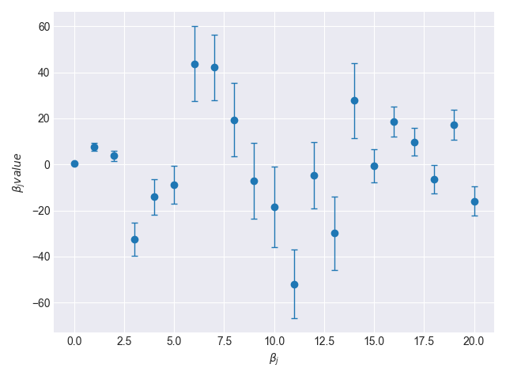
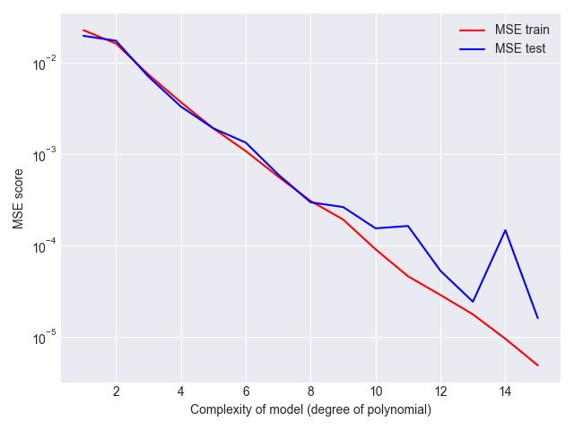
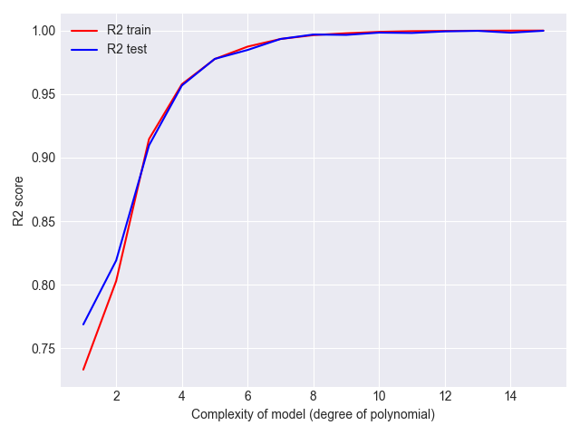
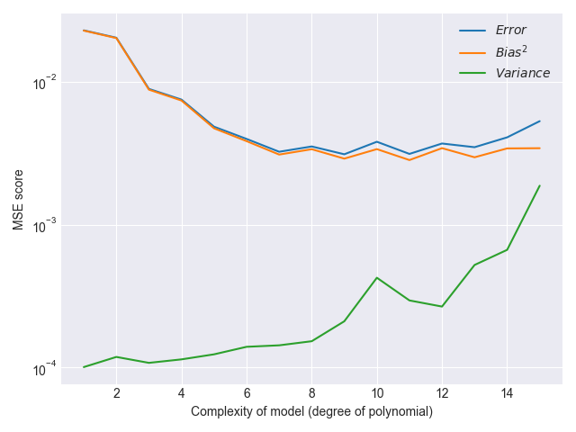
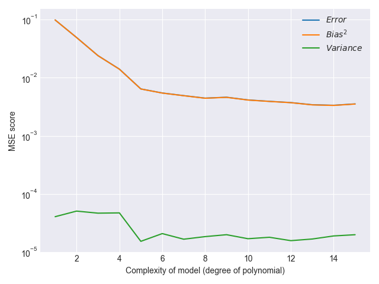

# Tests

## test_inversion.py
The file checks that the function from the Numpy library is equivalent to the SVD algorithm. **test_inversion.py** checks that
<pre><code> numpy.linalg.pinv(X) == SVD(X.T @ X) @ X.T </code></pre>

Run the test in the Tests directory with the command
<pre><code> $ python3 test_inversion.py </code></pre>

## Test runs

The following commands should be run in the src directory. After each command you should expect the resulting figures.

Example 1:
<pre><code> $ python3 project1.py -f errorVsComplexityNoResampling -m OLS -d franke -N 800 -deg 15 -r2 -ci 5  </code></pre>

Result 1:  

Example 2:
<pre><code> $ python3 project1.py -f biasVariance -m Ridge -d franke -N 1200 -deg 15 -l 1e-11 -no 0.05 -b 50 </code></pre>

Result 2:  

Example 3:
<pre><code> $ python3 project1.py -f biasVariance -m Ridge -d terrain -deg 15 -l 1e-5 -b 25 </code></pre>

Result 3:  
