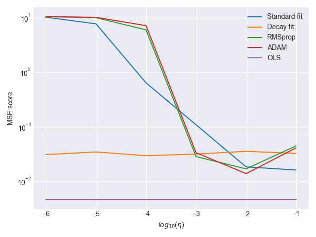

# Tests

## Test runs

The following commands should be run in the src directory. Below the commands, is the result you should expect.

Note: there may be some small difference between the provided result and what you get because when using Stochastic Gradient Descent, the dataset is shuffled for each epoch causing some differences.

Example 1:
<pre><code> $ python3 partA.py -N 200 -d 5 -t lr -e 50  </code></pre>

Result 1:  
  

Example 2:
<pre><code> $ python3 partBC.py -N 100 -d 5 -a tanh -o ADAM -e 10 -n 100 -mb 10 </code></pre>

Result 2:  

Example 3:  
<pre><code> $ python3 partDE.py -o ADAM -e 10 -n 10 -mb 150 -f logistic </code></pre>  

Result 3:  

