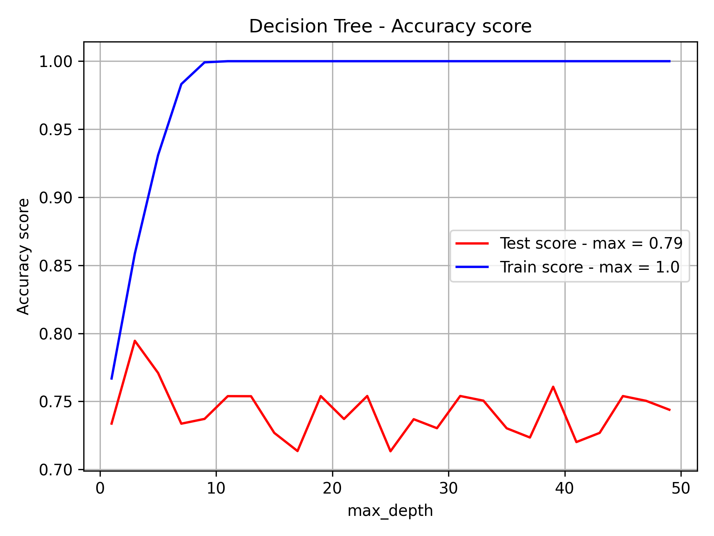
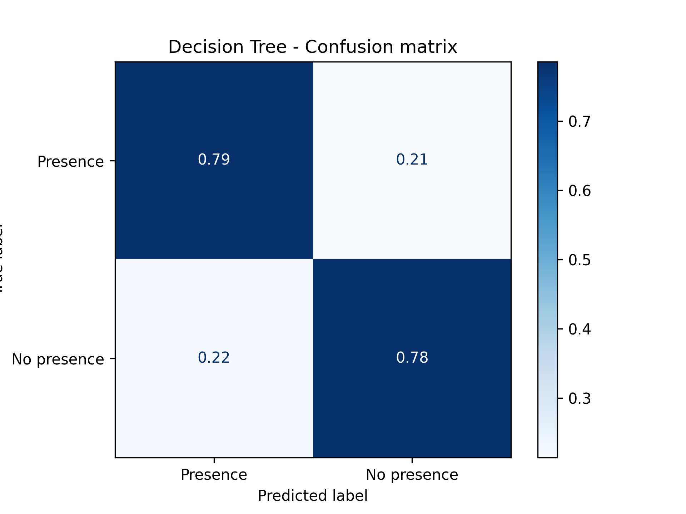
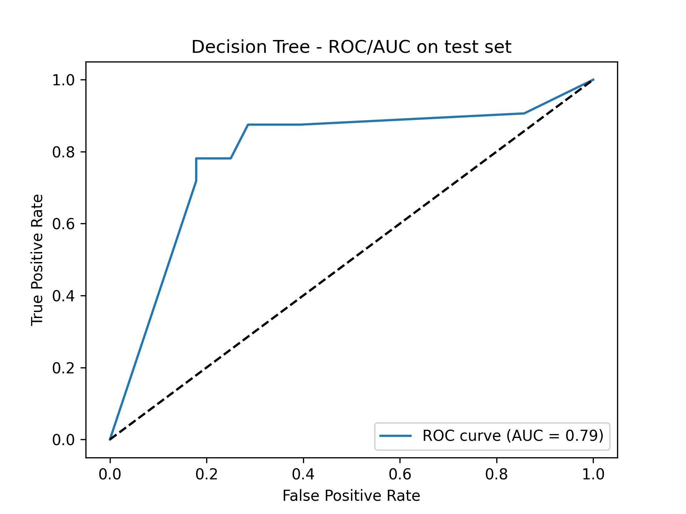
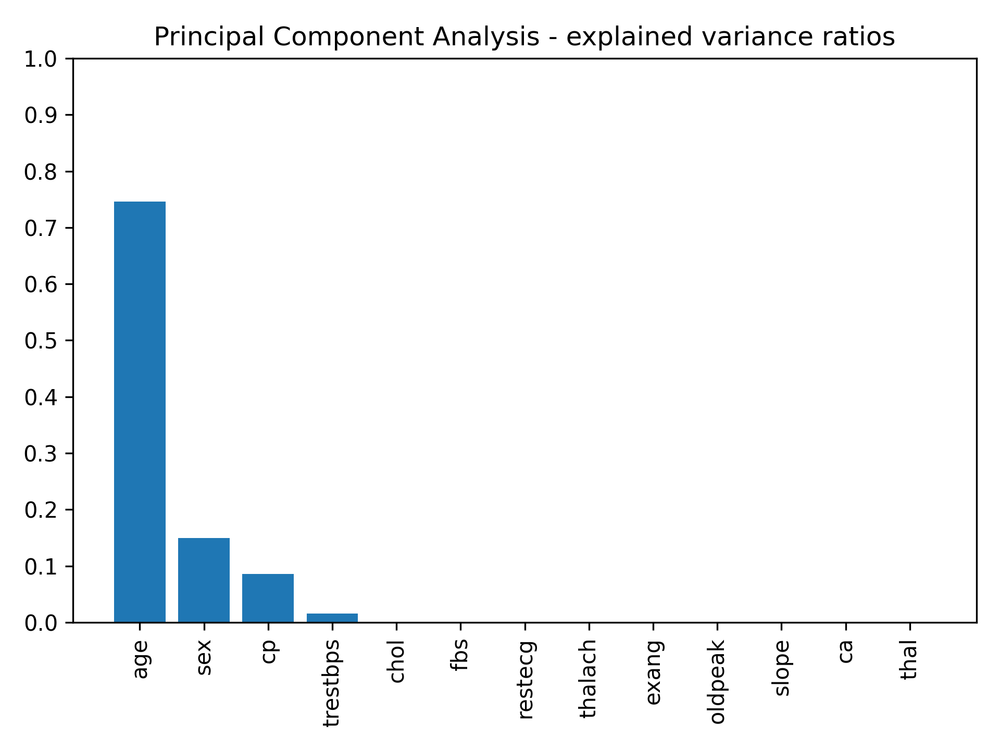

# Tests

## Test runs

The following commands should be run in the src directory. Below the commands, is the result you should expect.

Note: there may be some small difference between the provided result and what you get due to the randomness of k-fold cross validation and the way the data is split.

Example 1:
<pre><code> $ python3 project3.py tree  </code></pre>

Result 1:  
  

Example 2:  
<pre><code> $ python3 project3.py tree grid </code></pre>  

Result 2:  

(See **dt_best_results_grid.txt** for top 20 results from grid search)

Example 3:
<pre><code> $ python3 heart_disease_data_analysis.py pca </code></pre>

Result 3:  

